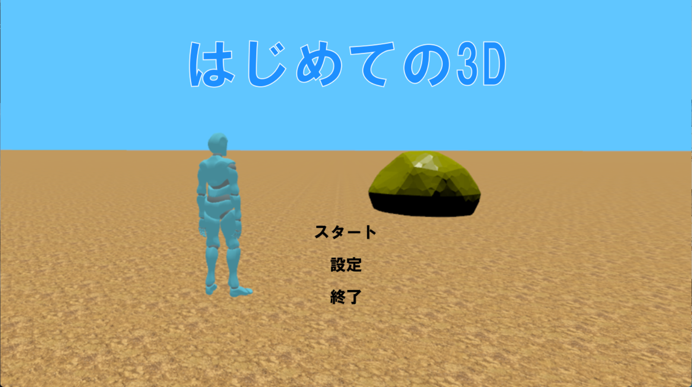
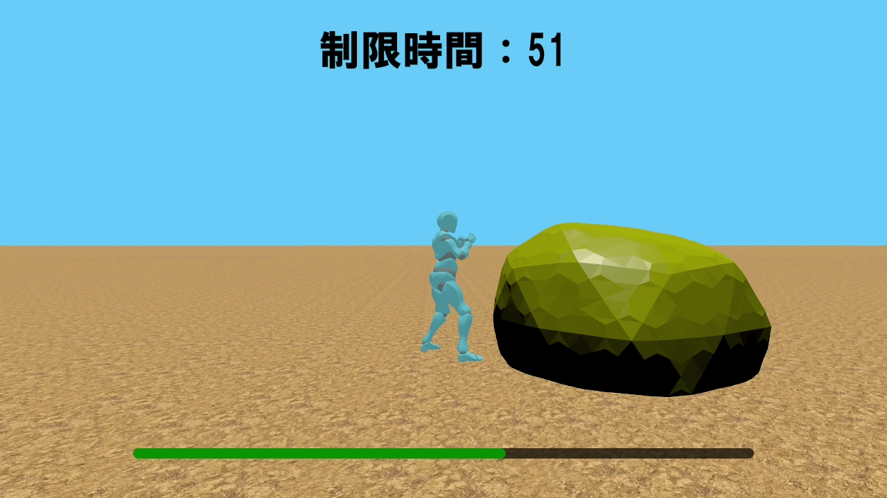

# はじめての3D
## タイムアタック3Dアクション

<table border="0">
  <tr>
    <td align="center" width="50%">
      <b>タイトル画面</b> 
      
    </td>
    <td align="center" width="50%">
      <b>コンボ例（弱 → 弱 → 弱 → 強）</b> 
      
    </td>
  </tr>
</table>

## 作品概要
- **開発環境**：C++ / Siv3D / Assimp / Visual Studio 2022
- **開発期間・人数**：2026年1月～2026年2月（2ヶ月） / 個人制作

## 特徴
- 弱攻撃や強攻撃によるコンボ攻撃を駆使し、制限時間内に岩を破壊する3Dアクションゲーム
- Siv3Dの機能を拡張し、外部ライブラリ（Assimp）と連携したFBXアニメーション再生システムを自作
- コンポーネント指向を取り入れ、モジュール化された拡張性の高いコード設計

## 技術的工夫
### 1. Assimpを用いたFBXアニメーション再生
Siv3Dの標準機能では対応していないFBXモデルのボーンアニメーション再生を行うために、Assimpライブラリを採用。 
ボーンの階層構造の解析とキーフレーム間の線形補間処理を自作クラスで実装しました。

### 2. コンポーネント指向によるコード設計
クラスの肥大化を防ぐため、コンポーネント指向を取り入れ、移動ロジックや描画など各役割を分離して保守性を向上するよう設計しました。

## 課題と解決法
- **課題：** Assimpから取得したボーン行列をメッシュに適用する際に、アニメーション実行時にモデルが崩れるバグが発生。
- **原因と解決：** Mixamo特有のピボット調整用ダミーノード（$AssimpFbx$）がノード階層内に挿入され、余分なオフセット行列が行列計算に含まれてしまっていたことが原因でした。 
ダミーノード独自の変換行列を計算に加えず、親から受け取った行列をそのまま子ノードへ引き渡す処理を行うことで正しいアニメーションの再生に成功しました。

## 操作方法
| キー | 動作 |
| :--- | :--- |
| **WASD** | 移動 |
| **マウス移動** | カメラ移動 |
| **左クリック** | 弱攻撃 |
| **右クリック** | 強攻撃 |

> 参考文献・引用
>
> 書籍 
> Sanjay Madhav 「ゲームプログラミングC++」　翔泳社　（2023） 
>
> Webサイト・技術記事 
> ことれい "【解説編】AssimpでFBXアニメーションを動かすための理論的な手順まとめ" [ことれいのもり](https://kotorei.com/c++/fbx-animation-assimp-guide-45) (参照 2026-02)
